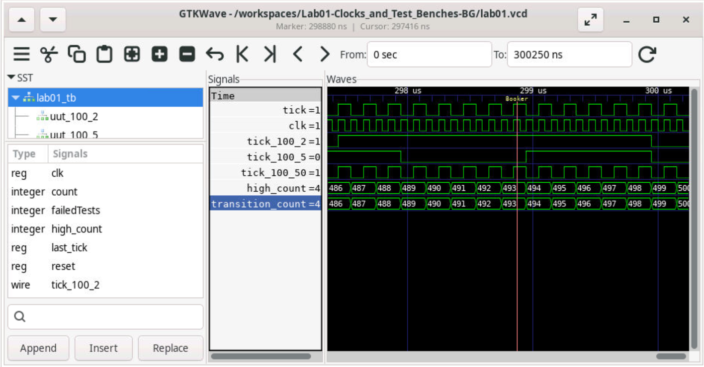

### Part 1:

What was already given was the first test case that tested the tick frequencies for 2hz. It tests if it is correctly functioning by checking whether there is a 50% load count by counting every time there is a tick. I added the test cases that tested the tick frequencies for 5hz and 50hz. They both do the same thing as the 2hz test case that was already there except there are now different frequencies. 

### Part 2: 
